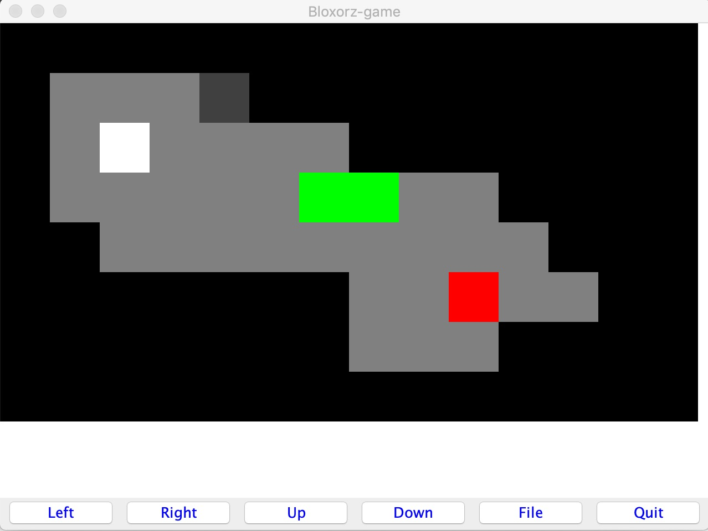
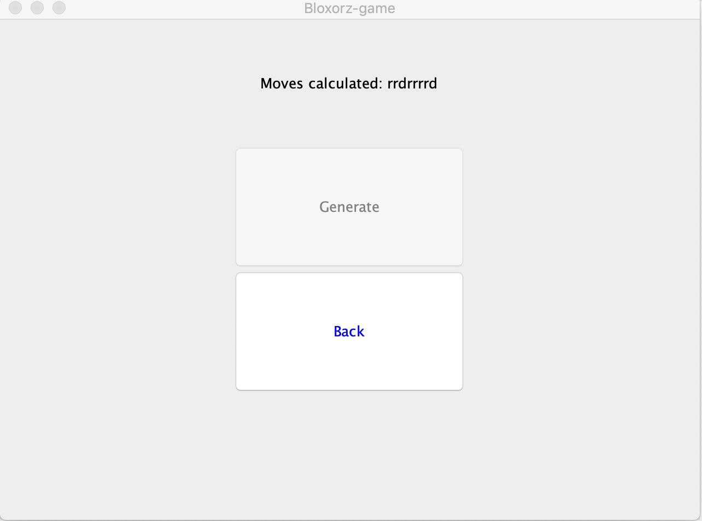
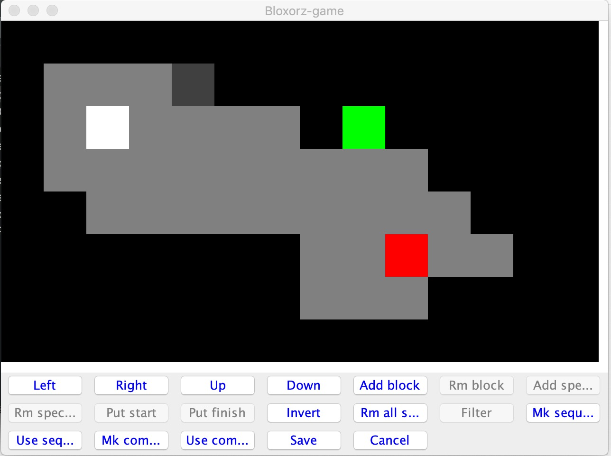

## Bloxorz-game:
 
[Download game v1.0](https://github.com/MrLaki5/Bloxorz-game/releases/download/v1.0/BloxorzGame.zip)

### Gameplay:
 Player controls a 1x2 rectangular block on a grid-based board. The goal is to move the block by rolling
 it to match the short end over the finish field. If player's block moves so as to hang off the platform, it will fall 
 and the player will have to start over from the starting position.

### Win sequence generation:
 In game there are built in algorithms that provide generation of win sequence, that can be used to pass levels.

### Map editing:
 For map generation, existing maps can be edited and saved as new. There is map editor with variety of editing options
 and possibility for player to create new, complex, editing options.

### Dependencies:
* Scala version: 2.12.8
* Java version: 8
* Scala Swing version: 2.12-2.1.1
